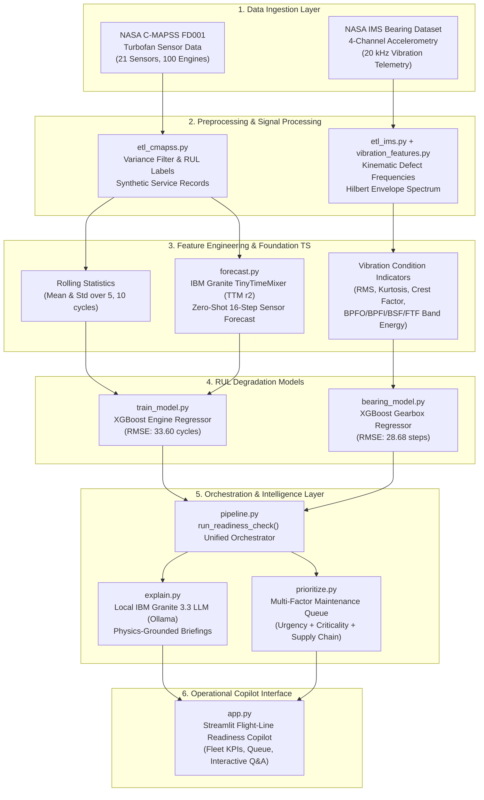

# Technical Architecture & System Design

## 1. End-to-End System Architecture

---

## 2. Component Responsibility Table

| Component | File / Module | Technology | Primary Responsibility |
|---|---|---|---|
| **Engine ETL** | `src/etl_cmapss.py` | Python, Pandas, PyArrow | Ingests NASA C-MAPSS text files, computes cycle-to-failure RUL labels, generates degradation-tier service records, outputs Parquet tables. |
| **Bearing Signal Processor** | `src/vibration_features.py` | SciPy, NumPy | Implements Rexnord ZA-2115 bearing geometry, calculates exact kinematics (BPFO/BPFI/BSF/FTF), applies Hilbert envelope FFT, extracts energy bands. |
| **Gearbox ETL** | `src/etl_ims.py` | Python, Pandas, PyArrow | Processes multi-channel IMS snapshots, builds vibration feature tables, generates gearbox maintenance history. |
| **Engine Model** | `src/train_model.py` | XGBoost, scikit-learn | Drops near-zero variance sensors, trains gradient boosted RUL regressor with early stopping, generates feature gain schemas. |
| **Time Series Foundation Model** | `src/forecast.py` | IBM Granite TTM (`granite-tsfm`), PyTorch | Runs zero-shot multi-variate sensor trend forecasting using the fine-tuned 52-16 TTM foundation model checkpoint. |
| **Gearbox Model** | `src/bearing_model.py` | XGBoost, scikit-learn | Trains vibration condition indicator RUL regressor, outputs standard prediction schema. |
| **Unified Orchestrator** | `src/pipeline.py` | Python | Routes mixed fleet assets by `asset_type`, triggers modality-specific feature pipelines and models, merges predictions. |
| **Explanation Engine** | `src/explain.py` | Local IBM Granite 3.3 (Ollama) / watsonx.ai | Formulates structured briefings citing multi-sensor readings and defect frequencies. Features fast-fail connectivity caching. |
| **Prioritization Engine** | `src/prioritize.py` | Python | Evaluates composite multi-factor scoring formula to sequence non-ready assets based on RUL urgency and parts availability. |
| **Operational Copilot Dashboard** | `src/app.py` | Streamlit, Plotly | Renders fleet command strip, ranked triage cards, sensor drill-downs, and natural-language maintainer Q&A. |

---

## 3. End-to-End Data Flow

### 1. Engine Turbofan Path
1. **Telemetry Feed:** Ingests 21 thermodynamic sensors and operational settings from C-MAPSS.
2. **Filtering:** Drops 10 uninformative channels with variance below 0.01.
3. **Feature Generation:** Generates rolling mean and standard deviation over 5 and 10 cycle windows.
4. **Foundation Forecasting:** Feeds last 52 cycles to IBM Granite TTM to forecast 16 future steps, extracting trend slopes.
5. **Inference:** XGBoost predicts Remaining Useful Life in cycles. If predicted RUL <= 20, the engine is flagged `NO-GO`.

### 2. Gearbox Bearing Path
1. **Vibration Stream:** Ingests 20 kHz 1-second accelerometry snapshots across 4 bearings.
2. **Kinematic Signal Processing:** Computes defect frequencies from Rexnord ZA-2115 bearing dimensions (N=16, Bd=0.331 in, Pd=2.815 in, contact angle 15.17 deg).
3. **Envelope Demodulation:** Hilbert transform demodulation isolates impulsive race impact harmonics from shaft vibrations.
4. **Condition Indicators:** Computes RMS, kurtosis, crest factor, and narrowband BPFO/BPFI spectral energy.
5. **Inference:** XGBoost predicts Remaining Useful Life in snapshot steps (~10 min intervals).

### 3. Unified Ingestion & Prioritization
1. `pipeline.py` joins predictions with service history (inspection dates, open write-ups, spare part lead times).
2. `explain.py` routes the asset to local IBM Granite with modality-appropriate system prompts:
   - Engines cite EGT and compressor pressures.
   - Gearboxes cite BPFO/BPFI bearing race spalling and kurtosis.
3. `prioritize.py` calculates composite priority scores and sorts grounded assets into an actionable queue.
4. `app.py` visualizes the resulting operational picture.

---

## 4. Enterprise Stack Mapping & Deliberate Divergence

| Enterprise Architecture Component | ReadyLine Implementation | Rationale for Deliberate Divergence |
|---|---|---|
| **IBM Maximo Asset Management** | Maximo-pattern unified Parquet schema (`output_real/`) | In military flight-line deployments, maintainers operate away from enterprise SQL servers. Parquet provides zero-overhead columnar storage matching Maximo data fields. |
| **IBM watsonx Orchestrate** | Modular Python pipeline orchestration (`pipeline.py`) | Hand-rolled Python routing executes cleanly in standalone edge environments with zero cloud latency and no external service dependencies. |
| **IBM watsonx.ai Cloud Foundation Models** | Local IBM Granite 3.3 2B served via Ollama | Bypasses external cloud provisioning hurdles (WSCPA0000E) and ensures full DDIL capability (forward operating bases with zero satellite uplink). |
| **IBM Granite Time Series (TTM)** | **Direct, Real TTM Foundation Model Integration** | Real zero-shot neural forecasting integrated using `granite-tsfm` and the fine-tuned 52-16 model branch. |
